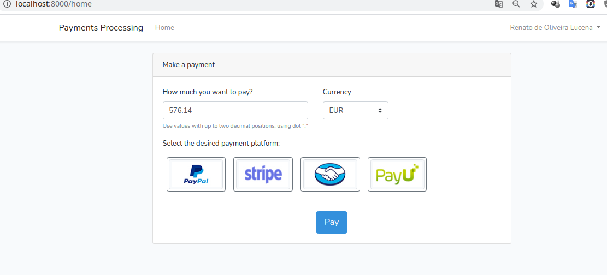

# Processe pagamentos com Laravel 6

## Processe pagamentos com Laravel e as melhores plataformas de pagamento
Este repositório é o resultado do curso que você encontra [aqui](https://www.udemy.com/course/procesa-pagos-en-linea-con-laravel-y-pasarelas-de-pagos-paypal-stripe/?referralCode=23F6FEDB611DEF416097).

## Integre gateways de pagamento como PayPal e Stripe para receber pagamentos online usando suas APIs do Laravel.

- Integre e receba pagamentos com o PayPal, usando a API do PayPal diretamente
- Integre e processe pagamentos com Stripe, diretamente usando a API Stripe
- Construir uma plataforma de pagamento que integra VÁRIOS gateways de pagamento ao mesmo tempo
- Entenda as etapas essenciais para processar pagamentos do Laravel, não só com - PayPal e Stripe, mas com qualquer outra plataforma.

> Código fonte do curso "Processar pagamentos com Laravel e as melhores plataformas de pagamento"

stripe paypal laravel php api stripe-api paypal-rest-api